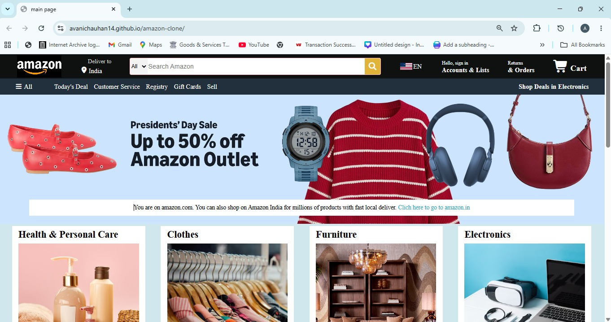
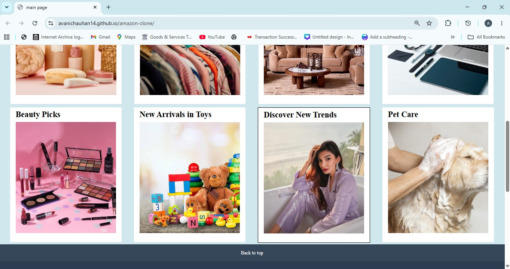
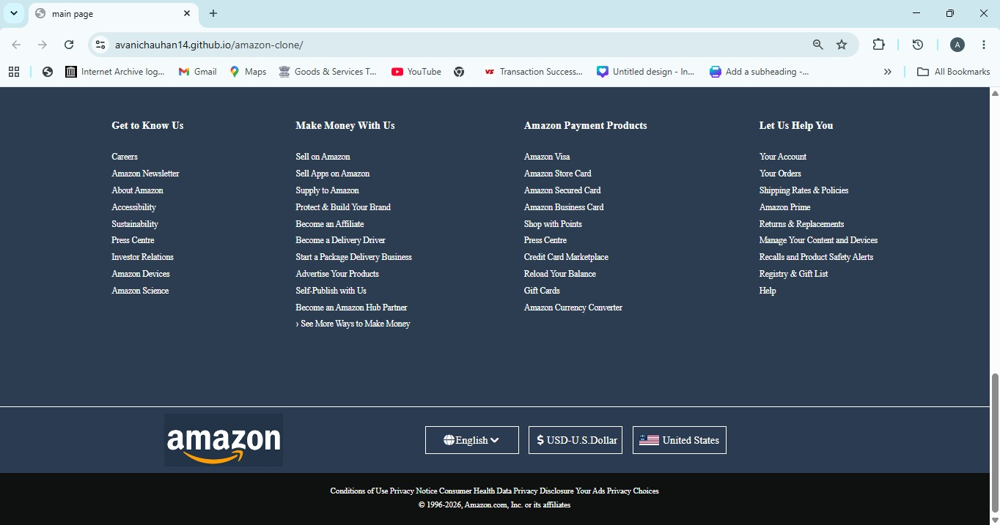

# Amazon Clone

This is a front-end clone of the Amazon homepage built using HTML and CSS. I created this project to practice webpage structuring, CSS layouts, and responsive design by recreating a real-world website.

## Features

- Amazon-inspired homepage layout
- Navigation bar with search section
- Hero banner
- Product category boxes
- Footer similar to Amazon
- Responsive layout using CSS

## Technologies Used

- HTML
- CSS

## What I Learned

While building this project, I got hands-on practice with:

- Structuring webpages using HTML
- Styling using CSS
- Flexbox for layout design
- Positioning and spacing elements
- Creating reusable sections
- Organizing project files

I also learned how to use Git and GitHub to manage my code and deploy the project using GitHub Pages.

## Future Improvements

Some features I'd like to add in the future:

- Make the website fully responsive for all screen sizes
- Add JavaScript for interactivity
- Create a shopping cart
- Add login and signup pages

## Screenshot of homepage
<h2>📸 Project Preview</h2>

  

  

## Author

**Avani Chauhan**
GitHub: https://github.com/avanichauhan14
